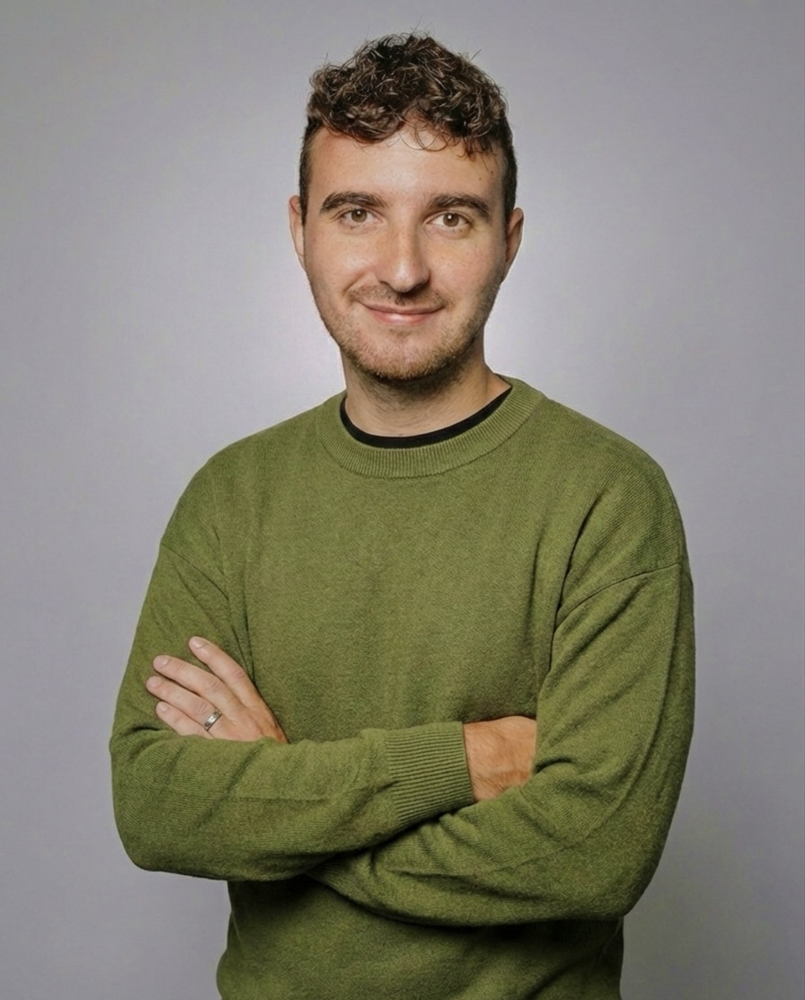

::: {.grid}

::: {.g-col-12 .g-col-md-4}
{.profile-pic}
:::

::: {.g-col-12 .g-col-md-8}
# Mattéo Lanoë {style="margin-top: 0;"}

<p style="color: #666; font-size: 1.3rem; font-weight: 300; margin-top: -10px; margin-bottom: 20px;">
**Doctoral Candidate, Sciences Po and French Institute for Demographic Studies (INED)**
</p>

Welcome! My name is Mattéo Lanoë and I am a first-year **Sociology PhD Candidate** affiliated with the [Center for Research on Social Inequalities (CRIS)](https://www.sciencespo.fr/cris/en/) at [Sciences Po](https://www.sciencespo.fr/departement-sociologie/en/) and **resident fellow** in the [Mortality, Health and Epidemiology](https://mse.site.ined.fr/en/) research unit at the [French Institute for Demographic Studies (INED)](https://www.ined.fr). My research is supervised both in sociology and social epidemiology, respectively by [Anne Revillard](https://www.sciencespo.fr/cris/fr/annuaire/revillard-anne/) at CRIS, and [Émilie Counil](https://www.ined.fr/fr/recherche/chercheurs/Counil+Emilie+) at INED. I am funded by the Sciences Po School of Research Doctoral Scholarship, for the 2025-2028 period. I will be a **doctoral resident fellow** at INED during the same period. I am a sociologist of **Long Covid** and other post-acute infectious diseases, which I study through the lens of socialization and social-biological interactions.

I am also an affiliated doctoral candidate, contributing to the collective research project ERC Synergy [Gender and Health Inequalities (Gendhi)](https://gendhi.eu/), coordinated by the [French Institute for Health and Medical Research (Inserm)](https://www.inserm.fr). The project is supervised by [Nathalie Bajos](https://iris.ehess.fr/index.php?4562), [Muriel Darmon](https://cessp.cnrs.fr/membre/darmon-muriel/), [Pierre-Yves Geoffard](https://www.parisschoolofeconomics.eu/personnes/pierre-yves-geoffard/), and [Michelle Kelly-Irving](https://cerpop.inserm.fr/michelle-kelly-irving-biographie). 

You will find my CRIS institutionnal webpage [there](https://www.sciencespo.fr/cris/en/directory/lanoe-matteo/).

::: {.grid}

::: {.g-col-12 .g-col-md-6}
```{=html}
<div class="contact-box">
 <h3>Contact</h3>  <div class="contact-item">
   <i class="bi bi-envelope"></i>    <a href="mailto:matteo.lanoe@sciencespo.fr">matteo.lanoe@sciencespo.fr</a>
 </div>  <div class="contact-item">
   <i class="bi bi-geo-alt"></i>    <span>CRIS, Sciences Po<br>1 Place Saint Thomas, 75007 Paris</span>
 </div>  <div class="contact-item">
   <i class="bi bi-twitter-x"></i>    <a href="[https://twitter.com/MatteoLanoe](https://twitter.com/MatteoLanoe)_" target="_blank">@MatteoLanoe_</a>
 </div>  <div class="contact-item">
   <i class="bi bi-clouds"></i>    <a href="[https://bsky.app/profile/matteolanoe.bsky.social](https://bsky.app/profile/matteolanoe.bsky.social)" target="_blank">@matteolanoe.bsky.social</a>
  </div>
</div>
```
:::

::: {.g-col-12 .g-col-md-6}
```{=html}
<div class="news-card">
 <h3>Latest News</h3>  
   <div class="news-scroll-zone">
   
      <div class="news-item">
     <div class="date-badge">        <span class="month">APRIL</span>
       <span class="day">6</span>      </div>
<div class="news-text">
        <p>Glad to share that I will present at the Sociology of Body and Embodiment Section of the American Sociological Association (ASA) Annual Meeting in New York City, next August!</p>
      </div>
    </div>
   
   <div class="news-item">
     <div class="date-badge">        <span class="month">FEB</span>
       <span class="day">10</span>      </div>
<div class="news-text">
        <p>I am pleased to announce that I have received the <a href="https://gestes.cnrs.fr/aap-amorcage/" target="_blank">Seed Grant</a> of the <a href="https://gestes.cnrs.fr" target="_blank">Working Group on Labor and Health at Work (GIS GESTES)</a>, totalling €8000. This grant will be dedicated to work on the collaborative and participative research project INCORP-19.</p>
      </div>
    </div>
   
       <div class="news-item">
     <div class="date-badge">        <span class="month">JAN</span>
       <span class="day">25</span>      </div>
     <div class="news-text">        <p>I will start giving my first course on quantitative methods for social sciences at Sciences Po, Poitiers Campus.</p>
     </div>    </div>

       <div class="news-item">
     <div class="date-badge">        <span class="month">NOV</span>
       <span class="day">28</span>      </div>
     <div class="news-text">        <p>I had the pleasure to introduce my PhD Research topic in front of the CRIS faculty! 😄</p>
     </div>    </div>

       <div class="news-item">
     <div class="date-badge">        <span class="month">OCT</span>
       <span class="day">16</span>      </div>
     <div class="news-text">        <p>New article in the <em>Revue française de science politique</em>, with François Hublet.</p>
     </div>    </div>

       <div class="news-item">
     <div class="date-badge">        <span class="month">OCT</span>
       <span class="day">01</span>      </div>
     <div class="news-text">        <p>I'm thrilled to share that I have started my doctoral studies at the CRIS and INED.</p>
     </div>    </div>

       
  </div> 
 
</div>
```
:::

:::