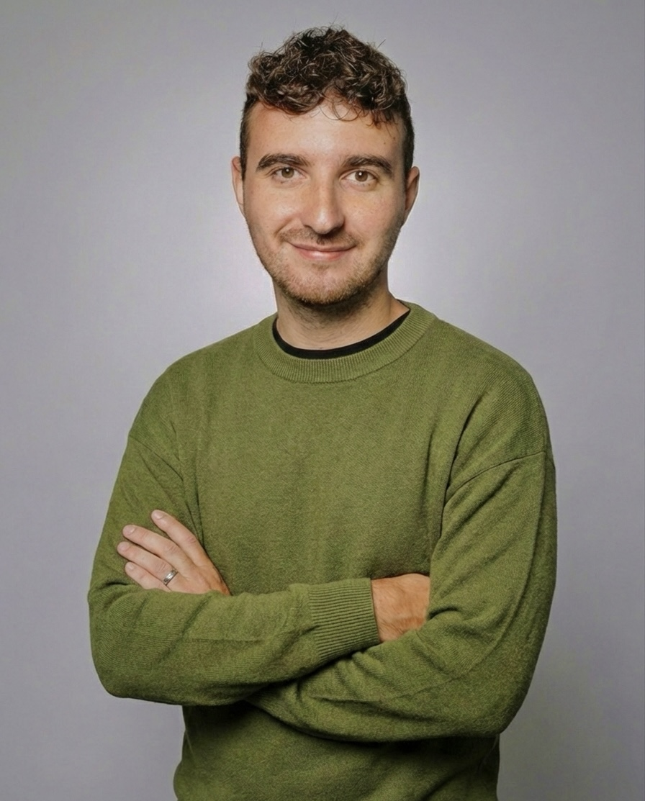

:::: {.profile-layout}

::: {.profile-photo}
{.profile-pic}
:::

::: {.profile-header}
# Mattéo Lanoë

<p class="profile-role">Doctoral Candidate, Sciences Po and French Institute for Demographic Studies (INED)</p>
:::

::: {.profile-bio}

Bienvenue! My name is Mattéo Lanoë and I am a PhD candidate in Sociology at [Sciences Po Paris](https://www.sciencespo.fr/departement-sociologie/fr/) based at the [Center for Research on Social Inequalities (CRIS)](https://www.sciencespo.fr/cris/fr/). I am also a resident doctoral fellow at the [French Institute for Demographic Studies (INED)](https://www.ined.fr/en), affiliated with the Mortality, Health, and Epidemiology Research Unit. My doctoral research is co-supervised in sociology and social epidemiology by [Anne Revillard](https://annerevillard.wordpress.com) (Sciences Po) and [Émilie Counil](https://www.ined.fr/fr/recherche/nos-chercheurs/emilie-counil) (INED), and supported by a doctoral fellowship from the Sciences Po School of Research (2025-2028).

Additionally, I contribute to the ERC-funded project [Gender and Health Inequalities (GENDHI)](https://gendhi.eu/en/home/), hosted at Inserm. Broadly, my research interests center on health inequalities, the body and embodiment, socialization, and chronic illness. My dissertation investigates Long Covid through the lens of dispositions and social life-pathologies interactions—examining how socially acquired and embodied dispositions shape illness trajectories, and how prolonged illness in turn reshapes socialization across the life course.

Alongside my doctoral research, I work on political and electoral sociology in the context of my implication in the *Electoral Bulletin of the European Union*. My work has appeared in the *Revue française de science politique*.

```{=html}
<div class="link-group">
  <div class="link-group-title">Academic profiles</div>
  <div class="link-pills">
    <a class="link-pill" href="https://www.sciencespo.fr/cris/en/directory/lanoe-matteo/" target="_blank" rel="noopener">
      <i class="bi bi-bank2"></i> CRIS profile <i class="bi bi-arrow-up-right link-ext"></i>
    </a>
    <a class="link-pill" href="https://www.ined.fr/en/node/24126" target="_blank" rel="noopener">
      <i class="bi bi-graph-up"></i> INED profile <i class="bi bi-arrow-up-right link-ext"></i>
    </a>
<a class="link-pill" href="../docs/images/CV_Matteo_Lanoe.pdf" target="_blank" rel="noopener">
  <i class="bi bi-file-earmark-person"></i> Curriculum Vitae <i class="bi bi-download link-ext"></i>
</a>
  </div>
  <div class="link-pills link-pills--lang">
    <a class="link-pill" href="fr/">
      <i class="bi bi-translate"></i> Version française
    </a>
  </div>
</div>
```

:::

::::

::: {.grid}

::: {.g-col-12 .g-col-md-4}
:::

::: {.g-col-12 .g-col-md-5}

```{=html}
<div class="homepage-publications">

  <div class="homepage-section-title">Publications</div>

  <div class="publication">
    <div class="publication-meta">2025</div>
    <div class="publication-main">
      <div class="pub-authors">Hublet, François &amp; <span class="me">Lanoë, Mattéo</span></div>
      <div class="pub-title">A Tale of Three Cleavages: Quantifying the Role of Social Demarcations in the 2022 French Presidential Election</div>
      <div class="pub-venue"><em>Revue française de science politique</em>, 75(2), 215–260</div>
      <a class="link-pill link-pill--sm" href="https://shs.cairn.info/revue-revue-francaise-de-science-politique-2025-2-page-215?lang=fr" target="_blank" rel="noopener">
        <i class="bi bi-journal-text"></i> Read article <i class="bi bi-arrow-up-right link-ext"></i>
      </a>
    </div>
  </div>

  <div class="publication">
    <div class="publication-meta">2023</div>
    <div class="publication-main">
      <div class="pub-authors">Hublet, François, <span class="me">Lanoë, Mattéo</span> &amp; Schleyer, Johanna</div>
      <div class="pub-title">Spelling out the European center-right’s dilemma: Renewal of the Grand coalition or National-Conservative Alliance?</div>
      <div class="pub-venue"><em>Groupe d'études géopolitiques</em></div>
      <a class="link-pill link-pill--sm" href="https://geopolitique.eu/en/2023/06/19/spelling-out-the-european-center-rights-dilemma-renewal-of-the-grand-coalition-or-national-conservative-alliance/" target="_blank" rel="noopener">
        <i class="bi bi-journal-text"></i> Read article <i class="bi bi-arrow-up-right link-ext"></i>
      </a>
    </div>
  </div>

</div>
```

:::

::: {.g-col-12 .g-col-md-3}

```{=html}
<div class="news-feed">

  <div class="homepage-section-title">News</div>

  <div class="news-scroll-wrap">
    <div class="news-scroll-zone">

      <div class="news-entry">
        <div class="news-head">
          <time class="news-date" datetime="2026-11">Nov 2026</time>
          <span class="news-tag news-tag--upcoming">Upcoming</span>
        </div>
        <p>I will present a poster at the 4th International Conference on Long Covid in Nice, with Anne Pastorello.</p>
      </div>

      <div class="news-entry">
        <div class="news-head">
          <time class="news-date" datetime="2026-08">Aug 2026</time>
          <span class="news-tag">Talk</span>
        </div>
        <p>I presented at the Sociology of Body and Embodiment Section of the American Sociological Association Annual Meeting in New York City.</p>
      </div>

      <div class="news-entry">
        <div class="news-head">
          <time class="news-date" datetime="2026-05-26">May 26, 2026</time>
          <span class="news-tag">Talk</span>
        </div>
        <p>I spoke at the INED Doctoral Workshop <em>(journée doctorale de l'Ined)</em> on how Long Haulers pathologize their symptoms.</p>
      </div>

      <div class="news-entry">
        <div class="news-head">
          <time class="news-date" datetime="2026-02-10">Feb 10, 2026</time>
          <span class="news-tag">Grant</span>
        </div>
        <p>I received an €8,000 <a href="https://gestes.cnrs.fr/projets-laureats-de-laap-fonds-damorcage-v1-2026/" target="_blank" rel="noopener">Seed Grant</a> from the <a href="https://gestes.cnrs.fr" target="_blank" rel="noopener">GIS GESTES</a> for the collaborative research project INCORP-19.</p>
      </div>

      <div class="news-entry">
        <div class="news-head">
          <time class="news-date" datetime="2026-01-25">Jan 25, 2026</time>
          <span class="news-tag">Teaching</span>
        </div>
        <p>I started teaching quantitative methods for social sciences at Sciences Po, Poitiers Campus.</p>
      </div>

      <div class="news-entry">
        <div class="news-head">
          <time class="news-date" datetime="2025-11-28">Nov 28, 2025</time>
          <span class="news-tag">Talk</span>
        </div>
        <p>I introduced my PhD research topic in front of the CRIS faculty.</p>
      </div>

      <div class="news-entry">
        <div class="news-head">
          <time class="news-date" datetime="2025-10-16">Oct 16, 2025</time>
          <span class="news-tag">Publication</span>
        </div>
        <p>New article in the <em>Revue française de science politique</em>, with François Hublet.</p>
      </div>

      <div class="news-entry">
        <div class="news-head">
          <time class="news-date" datetime="2025-10-01">Oct 1, 2025</time>
          <span class="news-tag">Milestone</span>
        </div>
        <p>I started my doctoral studies at CRIS and INED.</p>
      </div>

    </div>
  </div>

</div>
```

:::