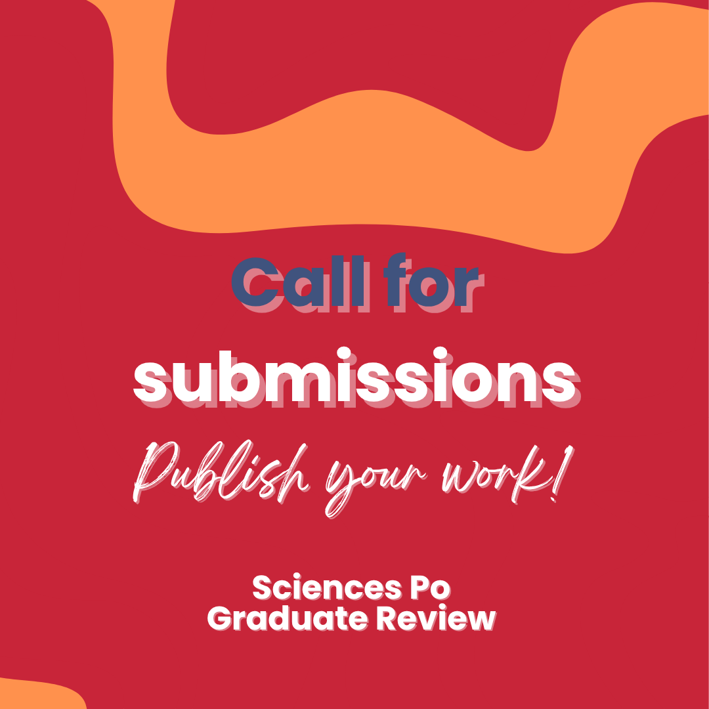

## Ongoing Projects

::::: grid
::: {.g-col-12 .g-col-md-8}
### Sciences Po Graduate Review (SPGR)

*Status: Currently crafting the inaugural issue*

The Sciences Po Graduate Review is a new endeavor that aims to be a biannual, student-run scientific review. Each issue, produced in both digital and print formats, will feature a mix of full-length research articles and shorter innovative contributions ("5 pagers"). All contributions will be made by graduate students. Submissions will be done primarily in English, with the option for French submissions. The quality of the submissions will be assesed by a peer-review process allowing for high standard contributions. It will be led by a pair of editors-in-chief and supported by an interdisciplinary board of master’s and doctoral student editors. The editorial team manages all stages of the publication process, from article selection and peer review coordination to layout and distribution. The project aims to promote and publicize the work of graduate students from the school as well as training them for future scientifc editorial work.

We started this projet last year, along with my cohort comrade [Éloi Bitri](https://www.linkedin.com/in/éloi-bitri-893b77338/?originalSubdomain=fr) (School of Research '25; please read his [amazing thesis here!](https://www.sciencespo.fr/ecole-recherche/sites/sciencespo.fr.ecole-recherche/files/BITRI-Eloi.pdf)). After having recruited a wonderful and dedicated team of editors, we launched our first [call for submissions](https://www.sciencespo.fr/ecole-recherche/en/news/call-for-contributions-sciences-po-graduate-review/), on the School of Research website! We are now collaborating with the Sciences Po Library and Librarians as well as the School of Research Association to make the review viable.

### Electoral Bulletin of the European Union (BLUE)

*A review edited by the Groupe d'études géopolitiques*

For five years up to now, I have been a member of the editorial board of the [Electoral Bulletin of the European Union (BLUE)](https://geopolitique.eu/numeros/elections-en-europe-2024/), a review published by the Groupe d'études géopolitiques based at the ENS. We publish bi-annual issues, covering elections taking place within the European continent. The publication process is done under the merry guidance of [François Hublet](https://hblt.eu), our editor-in-chief.
:::

::: {.g-col-12 .g-col-md-4}
{width="100%"}
:::
:::::

## Past Research Projects

### Body and Soul? Dispositions, Socialization(s) and Illness's Shape Trajectory Control of Post-Covid-19 Symptoms

Master's thesis done at the Sciences Po School of Research / the Department of Sociology, and supervised by Anne Revillard.

<details>

<summary>Abstract</summary>

<div>

Post-COVID-19 symptoms (PACS-19), or “long COVID,” are a major public health issue due to their lasting, adverse physical and cognitive consequences on quality of life. This study, grounded in structuralist and interactionist traditions, goes beyond traditional narrative approaches by examining how past experiences—through approaches based on quality of life and the sociology of socialization—influence the management of PACS-19. Based on twenty-three in-depth biographical interviews and twenty-four hours of observation in a specialized department, we show that PACS-19 generates both social and cultural capital gains and a lasting transformation of individual dispositions, redefining the configuration of each patient's dispositional heritage. The unequal mobilization of previously accumulated dispositions and capital leads to socially differentiated control strategies, revealing the social logics that govern the remission process. This thesis thus highlights the importance of integrating agents' pasts into the sociological analysis of chronic diseases in order to fully understand their dynamics and inequalities.

</div>

</details>

<details>

<summary>Recommended Citation</summary>

<div>

Lanoë, M. (2025). Corps et âmes ? Dispositions, socialisation(s) et contrôle de la trajectoire des symptômes post-Covid-19 \[Mémoire de master, École de la recherche, Institut d’études politiques de Paris\]. Sous la direction d’Anne Revillard.

* BibTeX citation:

```bibtex
@mastersthesis{lanoe2025corps,
 title = {Corps et âmes ? {Dispositions}, socialisation(s) et contrôle de la trajectoire des symptômes post-{Covid}-19},  author = {Lanoë, Mattéo},
 year = {2025},  school = {École de la recherche, Institut d’études politiques de Paris},
  note = {Sous la direction d’Anne Revillard}
}
```

</div>

</details>

### Politics in the House of Mirth: Dispositions and Political Socialization of ‘Grandes écoles’ Students

Master's thesis done at the Institut d'études politiques de Lyon (IEP de Lyon), and supervised by Anthéa Chenini and Sébastien Michon.

This master's thesis is the co-winner of the [**2024 Best Master's thesis prize**](https://www.ove-national.education.fr/prix-de-love/) of the Observatoire de la vie étudiante (OVE).

<details>

<summary>Abstract</summary>

<div>

In this master's thesis, we examine the impact of the grandes écoles system on students' political socialization throughout their family and school life. Our investigation is divided into two parts: the first focuses on primary socialization, highlighting the influence of childhood characterized by “concerted cultivation.” This phase prepares students to debate, develop rigorous arguments, and follow current events, thus shaping their ability to engage politically. The second part explores the respondents' entry into the grandes écoles system, revealing a process of total educational envelopment. Initially focused on academic success, this immersion evolves into political socialization protected from outside disturbances. The grandes écoles create a space for identity formation, promote political exchange, and encourage civic engagement through student stipends. Finally, schooling leaves a lasting mark on students' political perspectives, favoring a consensual and technoscientific approach. The grandes écoles system in France thus profoundly shapes its students' worldview and political outlook, preparing them for influential roles and dominant positions in society.

* <i class="bi bi-file-earmark-pdf"></i> [Download the manuscript (PDF)](images/LANOE_Memoire.pdf)

</div>

</details>

<details>

<summary>Recommended Citation</summary>

<div>

Lanoë, M. (2023). Le politique chez les heureux du monde. Dispositions et socialisation politiques des élèves des grandes écoles \[Mémoire de master, Institut d’études politiques de Lyon\]. Sous la direction d’Anthéa Chenini et de Sébastien Michon.

* BibTeX citation:

```bibtex
@mastersthesis{lanoe2023politique,
  title = {Le politique chez les heureux du monde. {Dispositions} et socialisation politiques des élèves des grandes écoles},
  author = {Lanoë, Mattéo},
  year = {2023},
  school = {Institut d'études politiques de Lyon},
  note = {Sous la direction d’Anthéa Chenini et de Sébastien Michon}
}
```

</div>

</details>
